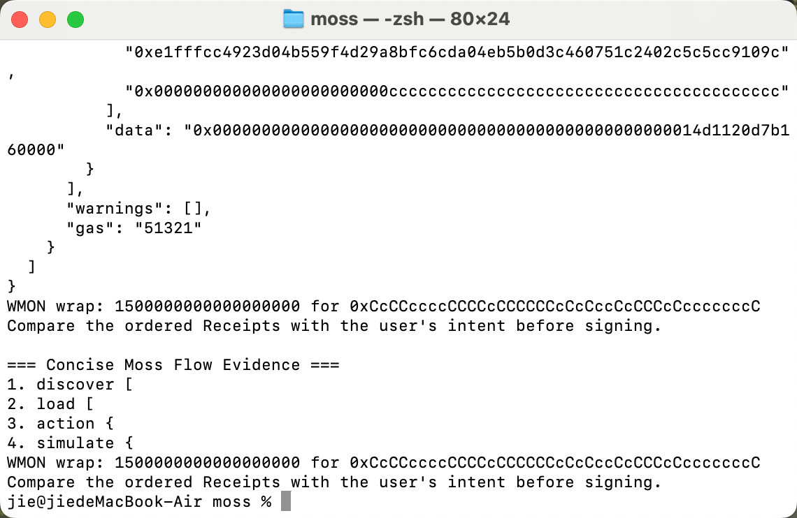

# Moss Prototype Evidence

## 1. Prototype Goal

在本地运行 Moss 官方 `simple-flow` 示例，验证以下完整流程：

~~~text
discover → load → action → simulate
~~~

本次原型使用 WMON `wrap` Capability，验证 Moss 能否：

1. 发现可用 Capability；
2. 加载协议和方法定义；
3. 构造未签名交易；
4. 在签名前执行模拟；
5. 输出结构化模拟结果和 Receipt。

## 2. Environment

- Node.js: `v24.14.0`
- pnpm: `11.10.0`
- Git: `2.54.0`
- Repository: `jzhao0/moss`
- Branch: `main`

项目要求：

- Node.js `>=22`
- pnpm `11.10.0`

## 3. Baseline Verification

在运行示例前，已完成以下检查：

~~~bash
pnpm install --frozen-lockfile
pnpm build
pnpm typecheck
pnpm lint
pnpm test:offline
~~~

验证结果：

- Dependencies installed successfully
- Build passed
- TypeScript typecheck passed
- Biome lint passed
- Offline tests passed

## 4. Prototype Command

~~~bash
pnpm --filter @themoss/example-simple-flow wrap
~~~

示例源文件：

~~~text
examples/simple-flow/src/wmon-wrap.ts
~~~

## 5. Safety Boundary

该示例：

- 不读取私钥；
- 不要求助记词；
- 不签名交易；
- 不发送真实交易；
- 默认使用虚拟账户地址；
- 仅构造 Capability 并进行签名前模拟。

默认账户：

~~~text
0xcccccccccccccccccccccccccccccccccccccccc
~~~

当模拟结果包含警告时，示例会提示：

~~~text
Warnings present. Stop; do not sign.
~~~

## 6. Result

本次运行成功输出了完整流程：

~~~text
1. discover
2. load
3. action
4. simulate
~~~

最终模拟结果包括：

~~~text
warnings: []
gas: 51321
WMON wrap: 1500000000000000000
~~~

`1500000000000000000` Wei 对应 `1.5 MON`。

最终安全提示：

~~~text
Compare the ordered Receipts with the user's intent before signing.
~~~

这表明 Moss 已成功构造并模拟 WMON wrap 操作，同时没有签名或发送真实交易。

## 7. Raw Evidence

完整终端输出保存在：

~~~text
prototype/evidence/simple-flow-wrap.log
~~~

日志 SHA-256：

~~~text
1a273030beb4646257a236a3a03cf157c6eb6cdcff81268b1257afaff86a4b12
~~~

核心终端截图：

## 8. Conclusion

本次原型证明 Moss 的核心工作流可以在本地成功运行：

~~~text
discover → load → action → simulate
~~~

Moss 将程序化操作转换为可验证的 Capability，并在签名前提供模拟结果、Gas 信息、状态变化和 Receipt，从而为 AI Agent 与 Web3 协议之间提供更安全、标准化的交互层。
