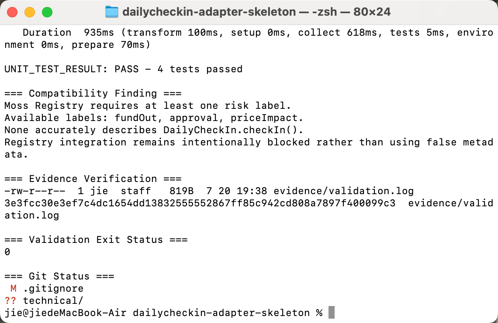

# DailyCheckIn Moss Adapter Skeleton

## Overview

This directory is a learning-oriented code skeleton that maps the existing
DailyCheckIn Solidity contract into Moss-style Protocol components.

The intended flow is:

~~~text
discover
  ↓
load DailyCheckIn Protocol
  ↓
construct checkIn Capability
  ↓
build unsigned transaction
  ↓
simulate
  ↓
parse CheckedIn event into a Receipt
~~~

## Source Contract

- Repository: `jzhao0/daily-checkin-monad`
- Contract: `DailyCheckIn.sol`
- Network: Monad Testnet
- Chain ID: `10143`
- Contract address:
  `0xcB4993E563a4C892d945277C53a39ee6885097E0`

## Document-to-Code Mapping

| Solidity element | Moss skeleton element |
|---|---|
| `checkIn()` | `@Capability checkIn()` |
| `canCheckIn(address)` | `@Query canCheckIn()` |
| `checkInCount(address)` | `@Query checkInCount()` |
| `lastCheckInDay(address)` | `@Query lastCheckInDay()` |
| `CheckedIn(...)` | `@Receipt checkInReceipt()` |
| contract ABI | `src/abis/dailycheckin.ts` |
| deployed address | `DAILY_CHECKIN_ADDRESS` |

## Directory Structure

~~~text
dailycheckin-adapter-skeleton/
├── README.md
├── AI_COLLABORATION.md
├── src/
│   ├── abis/
│   │   └── dailycheckin.ts
│   ├── adapter.ts
│   └── index.ts
└── test/
    └── adapter.test.ts
~~~

## Semantic Compatibility Gap

Moss currently provides these protocol categories:

~~~text
dex
lending
staking
rewards
token
nft
~~~

It also provides a fixed set of transaction verbs and does not currently
include a generic `check-in` verb.

For this learning skeleton, the following provisional mapping is used:

~~~text
category: rewards
verb: claim
~~~

This is only a type-compatible placeholder. It is not an assertion that a
daily check-in contract is genuinely a rewards protocol or that `checkIn()`
is semantically identical to `claim()`.

## Why This Is Not an Official Adapter

This skeleton is not ready for submission to Moss because:

1. the contract is deployed on Monad Testnet rather than Monad Mainnet;
2. the category and verb are only provisional mappings;
3. no live mainnet simulation has been completed;
4. the package has not been integrated into the Moss workspace;
5. maintainer alignment has not been obtained;
6. production-level address, bytecode, metadata, and provenance checks are
   not included.

## Safety Boundary

The code skeleton:

- constructs an unsigned transaction only;
- does not contain a private key;
- does not sign transactions;
- does not send transactions;
- does not require real funds;
- does not claim production readiness.

## Current Status

~~~text
Documentation understood: complete
ABI skeleton: complete
Protocol skeleton: complete
Capability skeleton: complete
Query skeletons: complete
Receipt parser skeleton: complete
Offline test skeleton: complete
Moss workspace integration: not completed
Live simulation: not completed
Official contribution: not started
~~~

## Conclusion

This exercise converts real Solidity documentation into a structured Moss
adapter skeleton while preserving an explicit distinction between:

~~~text
code that is structurally plausible
and
code that is semantically and operationally production-ready
~~~

## Validation Result

The skeleton was validated locally with:

~~~bash
pnpm typecheck
pnpm test
~~~

TypeScript compilation passes.

During the first test run, Moss rejected the Protocol with:

~~~text
capability "daily-checkin.checkIn" must declare a risk label
~~~

This is not hidden by assigning an inaccurate label. Moss currently requires
one of:

~~~text
fundOut
approval
priceImpact
~~~

None accurately describes a no-value daily check-in transaction.

The revised tests therefore verify:

1. typed `checkIn()` calldata construction;
2. successful `CheckedIn` event decoding;
3. rejection of events from unsupported addresses;
4. the expected Registry rejection caused by the current risk vocabulary.

Current result:

~~~text
TypeScript check: passed
ABI and event parser tests: passed
Moss Registry integration: blocked by risk-label vocabulary
Overall status: partially working, compatibility gap documented
~~~

## Evidence

完整验证日志：

[`evidence/validation.log`](evidence/validation.log)

日志 SHA-256：

~~~text
3e3fcc30e3ef7c4dc1654dd138325555552867ff85c942cd808a7897f400099c3
~~~

本地验证截图：

截图中记录了：

- TypeScript 类型检查通过；
- 4 项离线单元测试通过；
- 验证流程退出状态为 `0`；
- Moss 当前风险标签词汇与 DailyCheckIn 的兼容性缺口。
